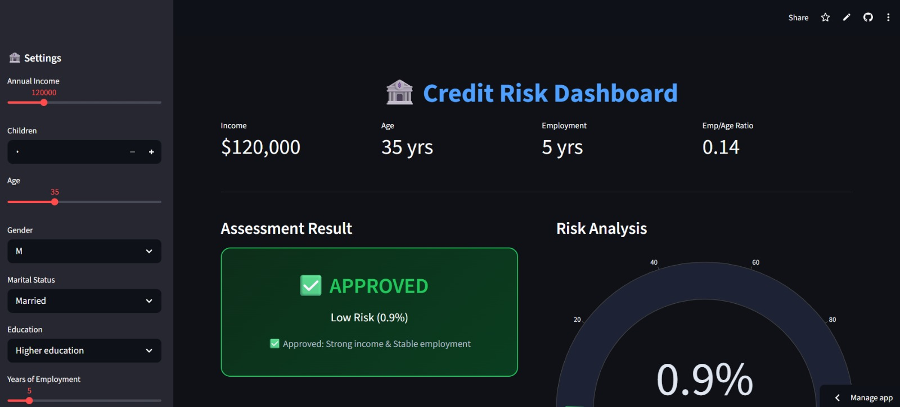

# 🏦 Credit Risk Prediction Dashboard

An interactive real-time web application designed to assess credit default risk using Machine Learning. This tool helps financial institutions make data-driven lending decisions by predicting the probability of a customer defaulting on a loan.

### 📊 Project Preview


## 🚀 Live Features
- **Real-time Prediction:** Adjust customer profiles using sliders and dropdowns to get instant risk assessments.
- **Dynamic Visualizations:** Includes a Gauge Chart for risk probability and a decision breakdown bar.
- **Automated Feature Engineering:** Handles Log transformations and ratio calculations on the fly.
- **Explainable AI:** Provides a brief human-readable reason for the Approval/Rejection decision.

## 🛠️ Tech Stack
- **Frontend:** [Streamlit](https://streamlit.io/)
- **Machine Learning:** [XGBoost](https://xgboost.readthedocs.io/)
- **Data Handling:** Pandas, Numpy
- **Visualization:** Plotly
- **Serialization:** Joblib

## 📈 Model Information
- **Algorithm:** XGBoost Classifier.
- **Preprocessing:** Standard Scaling (StandardScaler).
- **Decision Threshold:** set at **0.40** (Optimized for cautious lending).
- **Engineered Features:** 
  - `Income_log`: Logarithmic transformation of annual income.
  - `Employment_Age_Ratio`: Stability metric based on work history vs. age.
  - `Income_per_child`: Financial dependency ratio.

## 📂 Project Structure
```text
├── ml_project1.ipynb      # Training & EDA Notebook (الكود الأصلي)
├── deploy.py              # Main Streamlit application code
├── credit_risk_model.pkl  # Trained XGBoost model
├── scaler.pkl             # Fitted StandardScaler object
├── requirements.txt       # Project dependencies
└── README.md              # Project documentation
